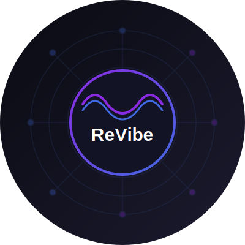

# ReVibe

<div align="center">
  
  
  <p align="center">
    <a href="https://www.revibe.one/" target="_blank">
      
    </a>
    <a href="https://x.com/ReVibe_AI" target="_blank">
      
    </a>
  </p>
</div>

ReVibe is a decentralized marketplace built on Ethereum blockchain, featuring AI-powered authentication and secure trading of limited edition items.

## Features

- Decentralized marketplace on Ethereum
- AI-powered product authentication
- Secure trading of limited edition items
- User profiles and transaction history
- Real-time price updates
- Mobile-responsive design

## Tech Stack

### Frontend
- React 18
- TypeScript
- Tailwind CSS
- Web3 Integration (ethers.js)

### Backend
- Go
- Gin web framework
- PostgreSQL
- GORM ORM

### Smart Contracts
- Solidity
- OpenZeppelin
- Hardhat

## Getting Started

### Prerequisites
- Node.js >= 16
- Go >= 1.19
- PostgreSQL >= 14
- Solidity >= 0.8.19

### Installation

1. Clone the repository
```bash
git clone https://github.com/yourusername/ReVibe.git
cd ReVibe
```

2. Frontend Setup
```bash
cd frontend
npm install
cp .env.example .env
# Edit .env with your configuration
npm start
```

3. Backend Setup
```bash
cd backend
go mod download
cp .env.example .env
# Edit .env with your configuration
go run main.go
```

4. Smart Contract Setup
```bash
cd contracts
npm install
cp .env.example .env
# Edit .env with your configuration
npx hardhat compile
```

## Documentation

- [Architecture](docs/ARCHITECTURE.md)
- [API Documentation](docs/API.md)
- [Frontend Guide](docs/FRONTEND.md)
- [Backend Guide](docs/BACKEND.md)
- [Smart Contracts](docs/CONTRACTS.md)
- [Development Guide](docs/DEVELOPMENT.md)
- [Contributing](docs/CONTRIBUTING.md)

## License

This project is licensed under the MIT License - see the [LICENSE](LICENSE) file for details. 